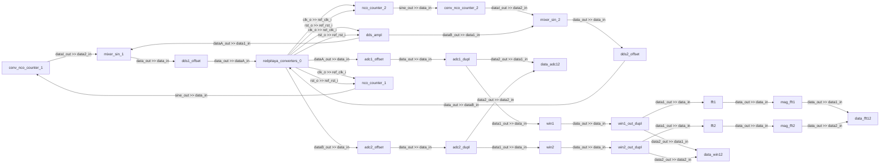

# adc_fft.tcl

```mermaid
graph LR
adc1_dupl --> |data1_out >> data_in| win1
adc1_dupl --> |data2_out >> data1_in| data_adc12
adc1_offset --> |data_out >> data_in| adc1_dupl
adc2_dupl --> |data1_out >> data_in| win2
adc2_dupl --> |data2_out >> data2_in| data_adc12
adc2_offset --> |data_out >> data_in| adc2_dupl
conv_nco_counter_1 --> |dataI_out >> data2_in| mixer_sin_1
conv_nco_counter_2 --> |dataI_out >> data2_in| mixer_sin_2
dds1_offset --> |data_out >> dataA_in| redpitaya_converters_0
dds2_offset --> |data_out >> dataB_in| redpitaya_converters_0
dds_ampl --> |dataA_out >> data1_in| mixer_sin_1
dds_ampl --> |dataB_out >> data1_in| mixer_sin_2
fft1 --> |data_out >> data_in| mag_fft1
fft2 --> |data_out >> data_in| mag_fft2
mag_fft1 --> |data_out >> data1_in| data_fft12
mag_fft2 --> |data_out >> data2_in| data_fft12
mixer_sin_1 --> |data_out >> data_in| dds1_offset
mixer_sin_2 --> |data_out >> data_in| dds2_offset
nco_counter_1 --> |sine_out >> data_in| conv_nco_counter_1
nco_counter_2 --> |sine_out >> data_in| conv_nco_counter_2
redpitaya_converters_0 --> |clk_o >> ref_clk_i| dds_ampl
redpitaya_converters_0 --> |clk_o >> ref_clk_i| nco_counter_1
redpitaya_converters_0 --> |clk_o >> ref_clk_i| nco_counter_2
redpitaya_converters_0 --> |dataA_out >> data_in| adc1_offset
redpitaya_converters_0 --> |dataB_out >> data_in| adc2_offset
redpitaya_converters_0 --> |rst_o >> ref_rst_i| dds_ampl
redpitaya_converters_0 --> |rst_o >> ref_rst_i| nco_counter_1
redpitaya_converters_0 --> |rst_o >> ref_rst_i| nco_counter_2
win1 --> |data_out >> data_in| win1_out_dupl
win1_out_dupl --> |data1_out >> data_in| fft1
win1_out_dupl --> |data2_out >> data1_in| data_win12
win2 --> |data_out >> data_in| win2_out_dupl
win2_out_dupl --> |data1_out >> data_in| fft2
win2_out_dupl --> |data2_out >> data2_in| data_win12
```
