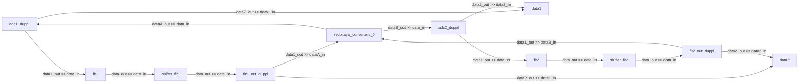

# adc_fir_dac.tcl

```mermaid
graph LR
adc1_duppl --> |data1_out >> data_in| fir1
adc1_duppl --> |data2_out >> data1_in| data1
adc2_duppl --> |data1_out >> data_in| fir2
adc2_duppl --> |data2_out >> data2_in| data1
fir1 --> |data_out >> data_in| shifter_fir1
fir1_out_duppl --> |data1_out >> dataA_in| redpitaya_converters_0
fir1_out_duppl --> |data2_out >> data1_in| data2
fir2 --> |data_out >> data_in| shifter_fir2
fir2_out_duppl --> |data1_out >> dataB_in| redpitaya_converters_0
fir2_out_duppl --> |data2_out >> data2_in| data2
redpitaya_converters_0 --> |dataA_out >> data_in| adc1_duppl
redpitaya_converters_0 --> |dataB_out >> data_in| adc2_duppl
shifter_fir1 --> |data_out >> data_in| fir1_out_duppl
shifter_fir2 --> |data_out >> data_in| fir2_out_duppl
```
