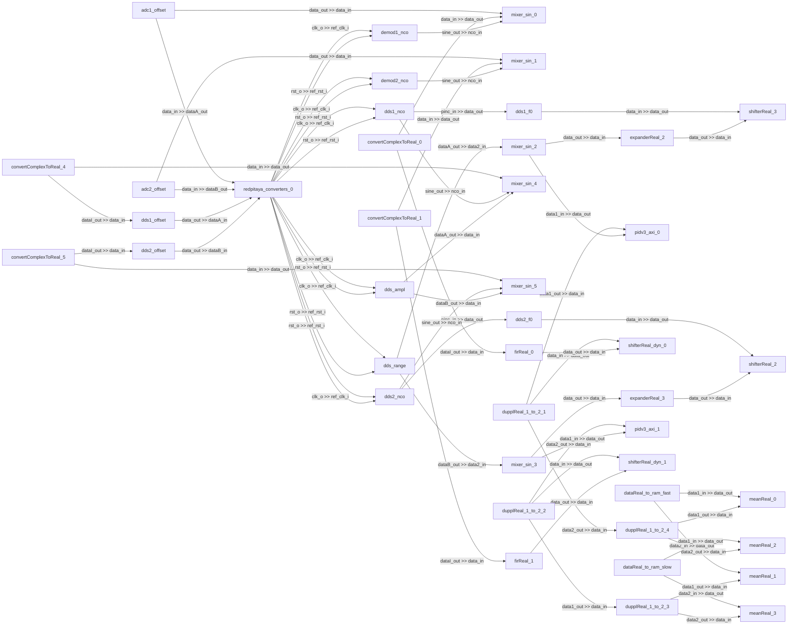

# double_iq_pid_vco.tcl

```mermaid
graph LR
adc1_offset --> |data_in >> dataA_out| redpitaya_converters_0
adc1_offset --> |data_out >> data_in| mixer_sin_0
adc2_offset --> |data_in >> dataB_out| redpitaya_converters_0
adc2_offset --> |data_out >> data_in| mixer_sin_1
convertComplexToReal_0 --> |data_in >> data_out| mixer_sin_0
convertComplexToReal_0 --> |dataI_out >> data_in| firReal_0
convertComplexToReal_1 --> |data_in >> data_out| mixer_sin_1
convertComplexToReal_1 --> |dataI_out >> data_in| firReal_1
convertComplexToReal_4 --> |data_in >> data_out| mixer_sin_4
convertComplexToReal_4 --> |dataI_out >> data_in| dds1_offset
convertComplexToReal_5 --> |data_in >> data_out| mixer_sin_5
convertComplexToReal_5 --> |dataI_out >> data_in| dds2_offset
dataReal_to_ram_fast --> |data1_in >> data_out| meanReal_0
dataReal_to_ram_fast --> |data2_in >> data_out| meanReal_1
dataReal_to_ram_slow --> |data1_in >> data_out| meanReal_2
dataReal_to_ram_slow --> |data2_in >> data_out| meanReal_3
dds1_f0 --> |data_in >> data_out| shifterReal_3
dds1_nco --> |pinc_in >> data_out| dds1_f0
dds1_nco --> |sine_out >> nco_in| mixer_sin_4
dds1_offset --> |data_out >> dataA_in| redpitaya_converters_0
dds2_f0 --> |data_in >> data_out| shifterReal_2
dds2_nco --> |pinc_in >> data_out| dds2_f0
dds2_nco --> |sine_out >> nco_in| mixer_sin_5
dds2_offset --> |data_out >> dataB_in| redpitaya_converters_0
dds_ampl --> |dataA_out >> data_in| mixer_sin_4
dds_ampl --> |dataB_out >> data_in| mixer_sin_5
dds_range --> |dataA_out >> data2_in| mixer_sin_2
dds_range --> |dataB_out >> data2_in| mixer_sin_3
demod1_nco --> |sine_out >> nco_in| mixer_sin_0
demod2_nco --> |sine_out >> nco_in| mixer_sin_1
dupplReal_1_to_2_1 --> |data1_out >> data_in| pidv3_axi_0
dupplReal_1_to_2_1 --> |data2_out >> data_in| dupplReal_1_to_2_4
dupplReal_1_to_2_1 --> |data_in >> data_out| shifterReal_dyn_0
dupplReal_1_to_2_2 --> |data1_out >> data_in| dupplReal_1_to_2_3
dupplReal_1_to_2_2 --> |data2_out >> data_in| pidv3_axi_1
dupplReal_1_to_2_2 --> |data_in >> data_out| shifterReal_dyn_1
dupplReal_1_to_2_3 --> |data1_out >> data_in| meanReal_1
dupplReal_1_to_2_3 --> |data2_out >> data_in| meanReal_3
dupplReal_1_to_2_4 --> |data1_out >> data_in| meanReal_0
dupplReal_1_to_2_4 --> |data2_out >> data_in| meanReal_2
expanderReal_2 --> |data_out >> data_in| shifterReal_3
expanderReal_3 --> |data_out >> data_in| shifterReal_2
firReal_0 --> |data_out >> data_in| shifterReal_dyn_0
firReal_1 --> |data_out >> data_in| shifterReal_dyn_1
mixer_sin_2 --> |data1_in >> data_out| pidv3_axi_0
mixer_sin_2 --> |data_out >> data_in| expanderReal_2
mixer_sin_3 --> |data1_in >> data_out| pidv3_axi_1
mixer_sin_3 --> |data_out >> data_in| expanderReal_3
redpitaya_converters_0 --> |clk_o >> ref_clk_i| dds1_nco
redpitaya_converters_0 --> |clk_o >> ref_clk_i| dds2_nco
redpitaya_converters_0 --> |clk_o >> ref_clk_i| dds_ampl
redpitaya_converters_0 --> |clk_o >> ref_clk_i| dds_range
redpitaya_converters_0 --> |clk_o >> ref_clk_i| demod1_nco
redpitaya_converters_0 --> |clk_o >> ref_clk_i| demod2_nco
redpitaya_converters_0 --> |rst_o >> ref_rst_i| dds1_nco
redpitaya_converters_0 --> |rst_o >> ref_rst_i| dds2_nco
redpitaya_converters_0 --> |rst_o >> ref_rst_i| dds_ampl
redpitaya_converters_0 --> |rst_o >> ref_rst_i| dds_range
redpitaya_converters_0 --> |rst_o >> ref_rst_i| demod1_nco
redpitaya_converters_0 --> |rst_o >> ref_rst_i| demod2_nco
```
