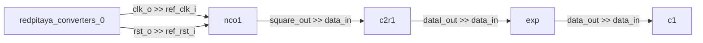

# nco_counter.tcl

```mermaid
graph LR
c2r1 --> |dataI_out >> data_in| exp
exp --> |data_out >> data_in| c1
nco1 --> |square_out >> data_in| c2r1
redpitaya_converters_0 --> |clk_o >> ref_clk_i| nco1
redpitaya_converters_0 --> |rst_o >> ref_rst_i| nco1
```
