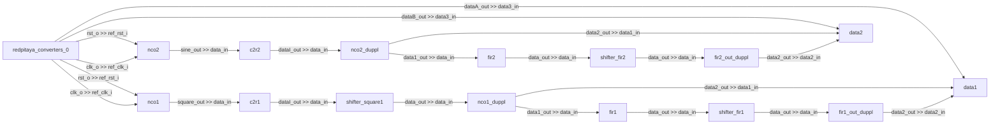

# nco_fir_dac_adc.tcl

```mermaid
graph LR
c2r1 --> |dataI_out >> data_in| shifter_square1
c2r2 --> |dataI_out >> data_in| nco2_duppl
fir1 --> |data_out >> data_in| shifter_fir1
fir1_out_duppl --> |data2_out >> data2_in| data1
fir2 --> |data_out >> data_in| shifter_fir2
fir2_out_duppl --> |data2_out >> data2_in| data2
nco1_duppl --> |data1_out >> data_in| fir1
nco1_duppl --> |data2_out >> data1_in| data1
nco1 --> |square_out >> data_in| c2r1
nco2_duppl --> |data1_out >> data_in| fir2
nco2_duppl --> |data2_out >> data1_in| data2
nco2 --> |sine_out >> data_in| c2r2
redpitaya_converters_0 --> |clk_o >> ref_clk_i| nco1
redpitaya_converters_0 --> |clk_o >> ref_clk_i| nco2
redpitaya_converters_0 --> |dataA_out >> data3_in| data1
redpitaya_converters_0 --> |dataB_out >> data3_in| data2
redpitaya_converters_0 --> |rst_o >> ref_rst_i| nco1
redpitaya_converters_0 --> |rst_o >> ref_rst_i| nco2
shifter_fir1 --> |data_out >> data_in| fir1_out_duppl
shifter_fir2 --> |data_out >> data_in| fir2_out_duppl
shifter_square1 --> |data_out >> data_in| nco1_duppl
```
