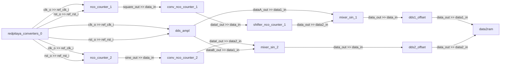

# nco_to_ram.tcl

```mermaid
graph LR
conv_nco_counter_1 --> |dataI_out >> data_in| shifter_nco_counter_1
conv_nco_counter_2 --> |dataI_out >> data2_in| mixer_sin_2
dds1_offset --> |data_out >> data1_in| data2ram
dds2_offset --> |data_out >> data2_in| data2ram
dds_ampl --> |dataA_out >> data1_in| mixer_sin_1
dds_ampl --> |dataB_out >> data1_in| mixer_sin_2
mixer_sin_1 --> |data_out >> data_in| dds1_offset
mixer_sin_2 --> |data_out >> data_in| dds2_offset
nco_counter_1 --> |square_out >> data_in| conv_nco_counter_1
nco_counter_2 --> |sine_out >> data_in| conv_nco_counter_2
redpitaya_converters_0 --> |clk_o >> ref_clk_i| dds_ampl
redpitaya_converters_0 --> |clk_o >> ref_clk_i| nco_counter_1
redpitaya_converters_0 --> |clk_o >> ref_clk_i| nco_counter_2
redpitaya_converters_0 --> |rst_o >> ref_rst_i| dds_ampl
redpitaya_converters_0 --> |rst_o >> ref_rst_i| nco_counter_1
redpitaya_converters_0 --> |rst_o >> ref_rst_i| nco_counter_2
shifter_nco_counter_1 --> |data_out >> data2_in| mixer_sin_1
```
